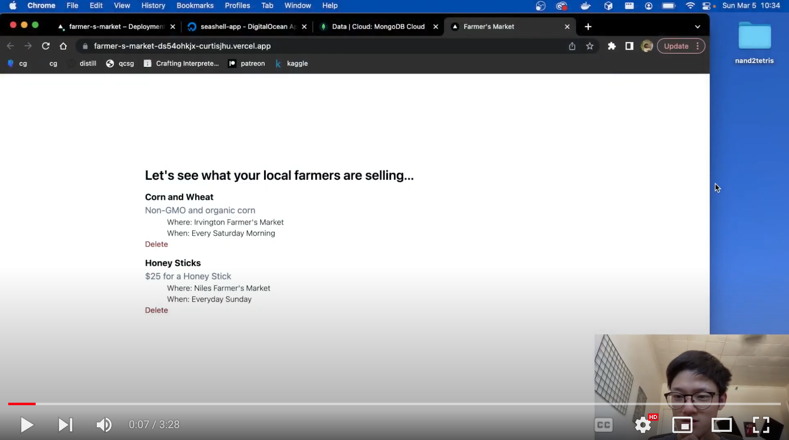

# Farmer's Market
Small Public Pinboard for the farmers.

This was a ~1 day project + some time to refine the code. I basically learned Ruby + Rails from scratch. 

> Frontend: Next.js + tailwindcss -> vercel
 

> Backend: RubyOnRails + MongoDB -> digital ocean docker container

Not much security is in play here. I'm on the free tier so it doesn't matter that much. 
Please don't DDoS the backend endpoints. I won't get charged over 5 bucks but I still would prefer my website working.

