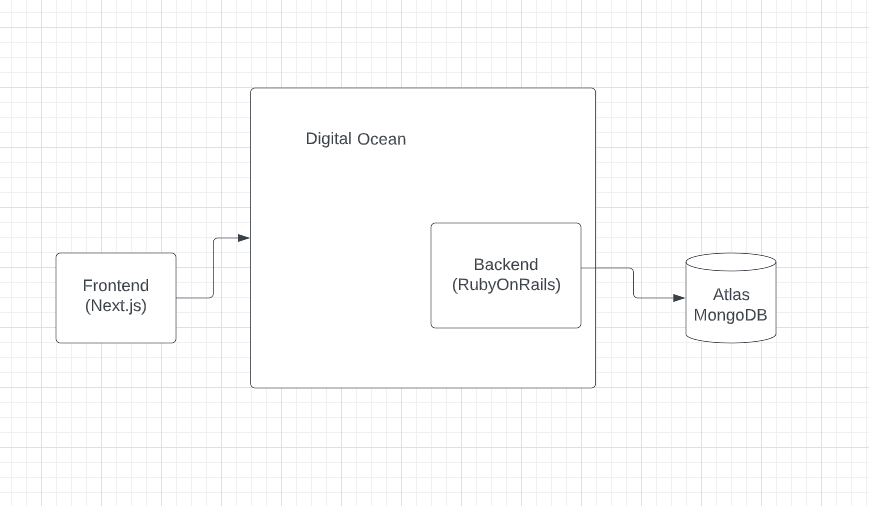

# Farmer's Market

> Note: Depending on when you are reading this, the actual site may be down due to costs.

Website: [farmer-s-market.vercel.app](farmer-s-market.vercel.app)

Small Public Pinboard for the farmers.

This was a ~1 day project + some time to refine the code. I basically learned Ruby + Rails from scratch. 

> Frontend: Next.js + tailwindcss -> vercel
 

> Backend: RubyOnRails + MongoDB -> digital ocean docker container

// 
